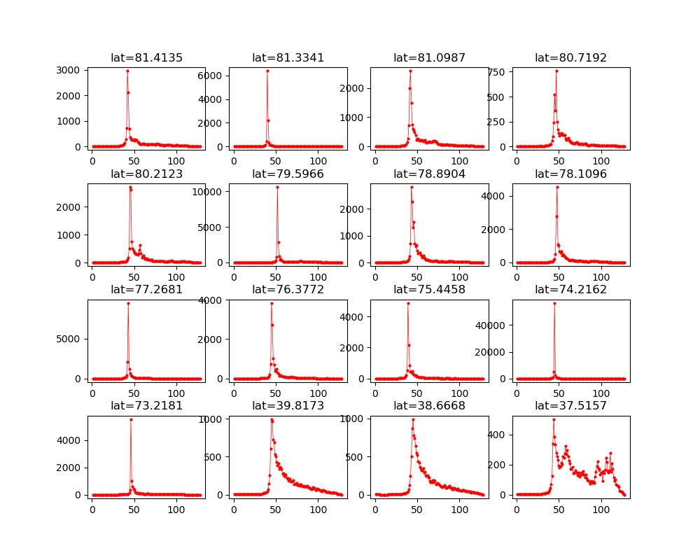
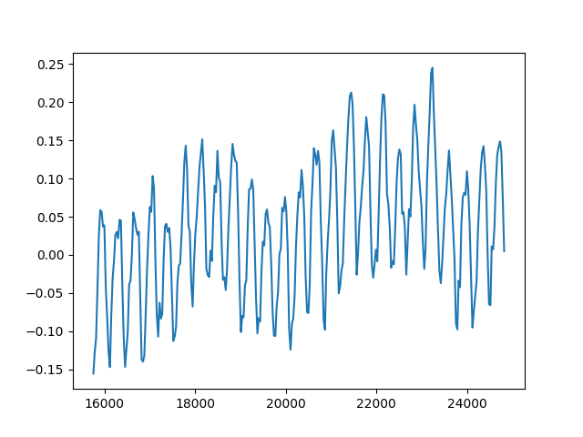

# Read me

## Introduction 
This software is aimed to read satellite altimetry data of the netCDF format. It is still undergoing development. More functions will be added in future, such as the waveform retracking over lakes, AI application on waveform determination, sea ice thickness estimation.

The netCDF4 lib is used under python3.
This software is aimed to:
- Read Sentinel-3A SRAL data, including the waveform data, analysis data and show data in
figures.
- Apply AI algorithm to the waveform data to classify sea ice and sea water in the arctic ocean.
- ...

## Snapshot of Examples
You can download data example from [here](https://www.jianguoyun.com/p/DfGdEB8Q2PCQBxidq9YC).

The waveform will be plotted as:

In the future, I will add the surface type determination (sea ice types, ponds in Arctic,etc.) by AI.

The time series of AVISO MMS over South China Sea will be plotted like:

The seasonal signals were not excluded here. 

The water level of the Poyang Lake during the flood will be estimated like (without data filtering and waveform retracking):

<fgure>

</fgure>

## usage
- Download the py file and example data.
- Change to correct file dir in the py file.
## LICENSE
Copyright (c) 2019-2020 by the yanglei.

<b>altimeter_read</b> is released under the [GNU Lesser General Public License](http://www.gnu.org/licenses/lgpl.html) version 3 or any later version.
## Software support
For general questions, do not be hesitate contact me:yangleir@qq.com
